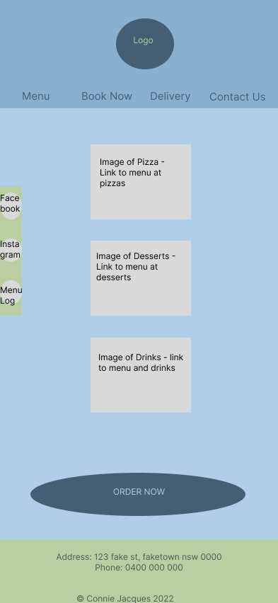
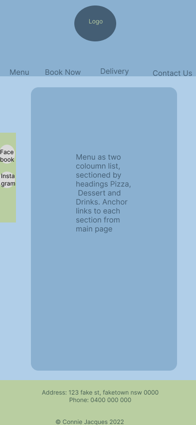
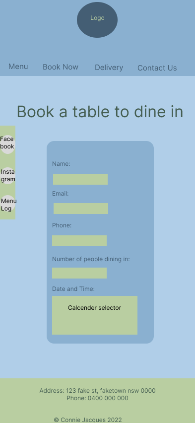

Challenge - "Client wnats a restaurant website fora locacl pizza shop opening soon. Can I get everyone to have a good landing pages, foods and beverages and booking form." - Akash

A mobile first design for a website to suit a small restaurant serving pizza, desserts and drinks with dine-in and take-away options (including ordering directly from the website for pick-up or delivery plus a link to order through MenuLog). 

Pizza image credit - Saundarya Srinivasan Unsplash.com

Dessert image credit - Pushpak Dsilva Unsplash

Drinks image credit - Kobby Mendez Unsplash

Icon credit -  Twitter Emoji - iconscout.com
<a href="https://iconscout.com/icons/pizza" target="_blank">Food Emoji Icon</a> by <a href="https://iconscout.com/contributors/twitter-inc" target="_blank">Twitter Emoji</a>

Facebook logo credit - https://fontawesome.com/v4/icon/facebook-official

Instagram logo credit - https://fontawesome.com/v4/icon/instagram

Cutlery igo credit - https://fontawesome.com/v4/icon/cutlery